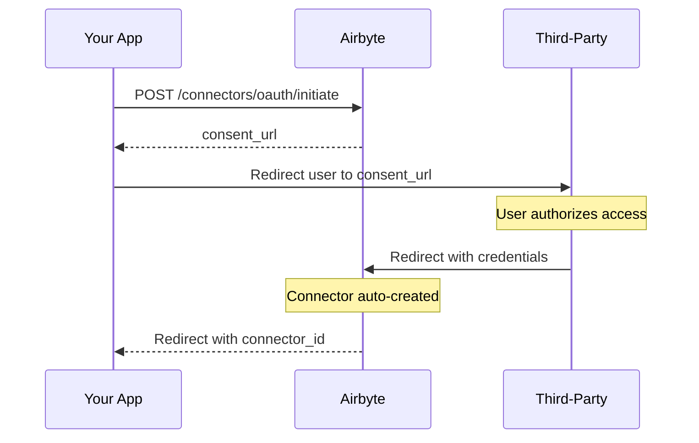

# Build your own OAuth flow

import Tabs from '@theme/Tabs';
import TabItem from '@theme/TabItem';

If you provide an environment where your users can create connectors on their own, they need to supply their credentials so agents can access their data. Airbyte provides an [Authentication module](./..) for this purpose. However, you might prefer to create a fully customized OAuth flow with your own branding, UX, and OAuth app. In this case, you can implement your own OAuth flow.

This tutorial walks you through implementing a server-side OAuth flow for your users. By the end, you'll be able to initiate OAuth consent, handle the callback, and use the automatically created connector.

## How it works

The server-side OAuth flow involves three main steps:

1. **Initiate OAuth**: Your backend calls Airbyte's API to get a consent URL for the connector.

2. **User consent**: You redirect your user to the consent URL where they authorize access to their account.

3. **Handle callback**: After authorization, Airbyte automatically creates the connector and redirects your user back to your app with a `connector_id`.



## Prerequisites

Before implementing an OAuth flow, ensure you have:

1. **Agent Engine credentials**: Your `client_id` and `client_secret` from the Agent Engine under **Authentication Module**.

2. **A bearer token**: See [Authentication](./..) for how to obtain one.

3. **A scoped token**: Required for some customer-level operations. Generate one using your application token.

4. **A redirect URL**: A URL in your app that receives the OAuth callback with the `connector_id`.

## Part 1: Configure OAuth overrides (optional)

By default, Airbyte uses its own OAuth app credentials for each connector. If you skip this step, the OAuth consent screen shows "Airbyte" as the requesting application.

You only need to configure OAuth overrides if you want to:

- **Custom branding**: Show your company's name and logo on the OAuth consent screen instead of Airbyte

- **Custom scopes**: Request different OAuth permissions than Airbyte's default app

- **Compliance requirements**: Use your own OAuth credentials for audit or security purposes

- **Rate limits**: Avoid shared rate limits on Airbyte's OAuth app for high-volume usage

If none of these apply, skip to [Part 2](#part-2-initiate-the-oauth-flow).

### Endpoint

```text
PUT https://api.airbyte.ai/api/v1/oauth/credentials
```

### Authentication

Requires a bearer token.

### Request body

| Field | Type | Required | Description |
|-------|------|----------|-------------|
| `connector_type` | string | Yes | Connector name (case-insensitive). For example, `hubspot`, `Salesforce`. |
| `configuration` | object | Yes | Your OAuth app credentials (client_id, client_secret, etc.). |

### Example

```bash title="Request"
curl -X PUT https://api.airbyte.ai/api/v1/oauth/credentials \
  -H 'Authorization: Bearer <operator_token>' \
  -H 'Content-Type: application/json' \
  -d '{
    "connector_type": "hubspot",
    "configuration": {
      "client_id": "your-hubspot-client-id",
      "client_secret": "your-hubspot-client-secret"
    }
  }'
```

```json title="Response"
{
  "id": "a1b2c3d4-e5f6-7890-ab12-cd34ef567890",
  "scope_type": "organization",
  "scope_id": "12345678-1234-1234-1234-123456789012",
  "connector_type": "source",
  "connector_definition_id": "36c891d9-4bd9-43ac-bad2-10e12756272c",
  "created_at": "2024-01-15T10:30:00Z",
  "updated_at": "2024-01-15T10:30:00Z"
}
```

The configuration schema varies by connector. To get the required fields for a specific connector, call `GET /api/v1/oauth/credentials/spec?connector_type=<connector_type>`.

## Part 2: Initiate the OAuth flow

When your user wants to connect a third-party service, initiate the OAuth flow to get a consent URL.

### Endpoint

```text
POST https://api.airbyte.ai/api/v1/integrations/connectors/oauth/initiate
```

### Authentication

Requires a bearer token or scoped token.

### Request body

| Field | Type | Required | Description |
|-------|------|----------|-------------|
| `external_user_id` | string | Yes | Your customer identifier. Maps to a customer in Airbyte. |
| `connector_type` | string | Yes* | Connector name (case-insensitive). For example, `hubspot`, `Salesforce`, `Intercom`. |
| `redirect_url` | string | Yes | Your callback URL. After OAuth consent, Airbyte auto-creates the connector and redirects the user here with `?connector_id=<value>`. |
| `name` | string | No | Display name for the connector. Auto-generated if not provided. |
| `replication_config` | object | No | Replication configuration for the source, such as `start_date` or `lookback_window`. Merged with OAuth credentials during source creation. |
| `source_template_id` | string (UUID) | No | Source template ID. Required when your organization has multiple source templates for this connector type. |
| `oauth_input_configuration` | object | No | Additional OAuth parameters required by some connectors. |

### Example

```bash title="Request"
curl -X POST https://api.airbyte.ai/api/v1/integrations/connectors/oauth/initiate \
  -H 'Authorization: Bearer <operator_token>' \
  -H 'Content-Type: application/json' \
  -d '{
    "external_user_id": "user_12345",
    "connector_type": "hubspot",
    "redirect_url": "https://yourapp.com/oauth/callback"
  }'
```

```json title="Response"
{
  "consent_url": "https://app.hubspot.com/oauth/authorize?client_id=...&redirect_uri=...&scope=..."
}
```

In your app, redirect your user to the `consent_url` from the response. This takes them to the third-party service's authorization page where they grant access to their account.

```javascript title="your-app.js"
const token = 'your_bearer_or_scoped_token';
const userId = 'user_12345';

const response = await fetch('https://api.airbyte.ai/api/v1/integrations/connectors/oauth/initiate', {
  method: 'POST',
  headers: {
    'Authorization': `Bearer ${token}`,
    'Content-Type': 'application/json'
  },
  body: JSON.stringify({
    external_user_id: userId,
    connector_type: 'hubspot',
    redirect_url: 'https://yourapp.com/oauth/callback'
  })
});

const { consent_url } = await response.json();

// Redirect the user to the consent URL
window.location.href = consent_url;
```

## Part 3: Handle the callback

After the user authorizes access, Airbyte automatically creates the connector and redirects them to your `redirect_url` with a `connector_id` query parameter. You don't need to make a separate API call to create the connector.

Extract the `connector_id` from the callback URL and store it for future operations.

```text
https://yourapp.com/oauth/callback?connector_id=f1e2d3c4-b5a6-7890-fe12-dc34ba567890
```

```javascript title="your-app.js"
const urlParams = new URLSearchParams(window.location.search);
const connectorId = urlParams.get('connector_id');

// Store the connector_id for future operations
await saveConnectorForUser(userId, connectorId);
```

If an error occurs during the OAuth flow, Airbyte redirects to your `redirect_url` with `error` and `error_description` query parameters instead.

```text
https://yourapp.com/oauth/callback?error=creation_failed&error_description=...
```

Handle the error and show a descriptive message to your user.

```javascript title="your-app.js"
const urlParams = new URLSearchParams(window.location.search);
// highlight-next-line
const error = urlParams.get('error');
const connectorId = urlParams.get('connector_id');

// highlight-start
if (error) {
  const errorDescription = urlParams.get('error_description');
  // Handle the error, e.g. prompt the user to retry
} else if (connectorId) {
  // Store the connector_id for future operations
  await saveConnectorForUser(userId, connectorId);
}
// highlight-end
```

## Part 4: Execute operations

Once the connector is created, you can use it in hosted mode to execute operations. See [how to execute operations](../../execute).

## Complete example

Here's a complete Node.js example implementing the server-side OAuth flow:

```javascript title="your-app.js"
const express = require('express');
const app = express();
app.use(express.json());

const AIRBYTE_API_BASE = 'https://api.airbyte.ai/api/v1';
const OPERATOR_TOKEN = process.env.AIRBYTE_OPERATOR_TOKEN;

// Step 1: Initiate OAuth when user clicks "Connect HubSpot"
app.post('/api/connect/:connectorType', async (req, res) => {
  const { connectorType } = req.params;
  const { userId } = req.body;

  const redirectUrl = new URL('https://yourapp.com/oauth/callback');
  redirectUrl.searchParams.set('user_id', userId);

  const response = await fetch(`${AIRBYTE_API_BASE}/integrations/connectors/oauth/initiate`, {
    method: 'POST',
    headers: {
      'Authorization': `Bearer ${OPERATOR_TOKEN}`,
      'Content-Type': 'application/json'
    },
    body: JSON.stringify({
      external_user_id: userId,
      connector_type: connectorType,
      redirect_url: redirectUrl.toString()
    })
  });

  if (!response.ok) {
    const error = await response.json();
    return res.status(response.status).json(error);
  }

  const { consent_url } = await response.json();
  res.json({ consent_url });
});

// Step 2: Handle OAuth callback - connector is already created
app.get('/oauth/callback', async (req, res) => {
  const { connector_id, user_id, error, error_description } = req.query;

  if (error) {
    console.error(`OAuth failed: ${error} - ${error_description}`);
    return res.redirect(`/connection-error?message=${encodeURIComponent(error_description || error)}`);
  }

  // Store the connector_id for future operations
  await saveConnectorForUser(user_id, connector_id);

  res.redirect('/connection-success');
});

// Step 3: Execute operations using the connector
app.post('/api/execute', async (req, res) => {
  const { userId, entity, action, params } = req.body;

  const scopedToken = await getScopedTokenForUser(userId);
  const connectorId = await getConnectorIdForUser(userId);

  const response = await fetch(`${AIRBYTE_API_BASE}/integrations/connectors/${connectorId}/execute`, {
    method: 'POST',
    headers: {
      'Authorization': `Bearer ${scopedToken}`,
      'Content-Type': 'application/json'
    },
    body: JSON.stringify({ entity, action, params })
  });

  if (!response.ok) {
    const error = await response.json();
    return res.status(response.status).json(error);
  }

  const result = await response.json();
  res.json(result);
});

app.listen(3000);
```

## Troubleshooting

**"Workspace not found" or "customer not found" error:**

- Ensure the `external_user_id` you provide in the initiate step is correct. Airbyte creates the customer automatically on first use.

**OAuth consent URL returns an error:**

- Verify you configured your OAuth credentials correctly in Part 1.
- Check that the connector supports OAuth authentication.
- Ensure your redirect URL is properly URL-encoded if it contains special characters.

**Callback returns an `error` parameter instead of `connector_id`:**

- The `error_description` parameter contains details about what went wrong.
- Common errors include the user denying consent or the OAuth session expiring. Initiate a new OAuth flow to retry.

**Connector is created but operations fail:**

- Verify the user completed the OAuth consent flow and granted all required permissions.
- Check that you properly provided all of that connector's required fields.
- Some connectors require specific scopes. Review the connector's documentation.
